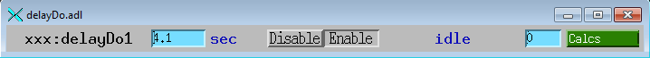

# delayDo

For situations when something needs to be done after an intelligent delay. Please email any comments and bug reports to [Kevin Peterson](mailto:kmpeters_at_anl.gov)

## Motivation

Many records can add a delay before writing to their output, but that is often not sophisticated enough for real applications. There are times when the delay timer needs to be reset or temporarily disabled. The delayDo support was written to provide this functionality. 

## Overview

In the simplest mode of operating, delayDo behaves identically to a similar database with a fixed delay. The delayDo support, however, is highly customizable.  

### Records provided by delayDo.db:

| __Record Name__ | __Record Type__ | __Purpose__ |
|---|---|---|
| $(P)$(R):activeCalc | [calcout](https://wiki-ext.aps.anl.gov/epics/index.php/RRM_3-14_Calcout) | delayDo.st monitors activeCalc and starts the delay timer when activeCalc's output transitions to zero. |
| $(P)$(R):doSeq | [sseq](https://htmlpreview.github.io/?https://raw.githubusercontent.com/epics-modules/calc/master/documentation/sseqRecord.html) | doSeq is the output of the delayDo support. It is processed by delayDo.st when the delay timer expires. |
| $(P)$(R):standbyCalc | [calcout](https://wiki-ext.aps.anl.gov/epics/index.php/RRM_3-14_Calcout) | delayDo.st monitors standbyCalc and enters the standby state when standbyCalc's output transitions to a non-zero value. |
| $(P)$(R):enable | bo | Allows delayDo.st to be put into a disabled state. |
| $(P)$(R):delay | ao | The amount of time in seconds to wait from transition out of the active state until the doSeq is processed. |
| $(P)$(R):delayCalc | [calcout](https://wiki-ext.aps.anl.gov/epics/index.php/RRM_3-14_Calcout) | (OPTIONAL) Allows the calculation of the delay period if the delay depends on other PVs |
| $(P)$(R):state | stringout | Contains the current state of delayDo.st |
| $(P)$(R):debug | longout | Allows enabling debug messages on the IOC console by setting to a non-zero value (higher numbers generate more messages) |

### Notes about behavior of delayDo.st:

- The waiting state will be interrupted if the active calc outputs a non-zero value, which will result in further delaying the processing of the doSeq.
- In the standby state, delayDo.st will detect active-&gt;inactive transitions and respond to them after returning from standby.
- In the disabled state, delayDo.st will ignore any active-&gt;inactive transitions and clear any resume-delay flags.

### MEDM

This is the MEDM screen for delayDo:  
  
  

## Use cases

### 1. Disabling in-vacuum motors to prevent overheating

#### Goal

Disable (by stopping) six in-vacuum motors if they haven't moved in four seconds, but only if no scans (from multiple IOCs) are in progress and the motors aren't disabled. 

#### Requirements

- Standby if the FAZE fields of scan1 in the following IOCs are not "IDLE": aaa, bbb, ccc, ddd, eee, xxx
- Standby if the motor is disabled
- Active if motor is not done moving
- Output "1" to motor STOP field after fixed delay of 4.0 seconds

#### delayDo.substitutions

> ```
> file "$(TOP)/xxxApp/Db/delayDo.db"
> {
> pattern
> { P,    R,        SB_INPA,             SB_INPB,             SB_INPC,              SB_INPD,            SB_INPE,             SB_INPF,             SB_INPG,               SB_CALC,                A_INPA,         A_CALC, D_STR1,     D_LNK1,       DELAY}
> {xxx:, m1, "aaa:scan1.FAZE CP", "bbb:scan1.FAZE CP", "ccc:scan1.FAZE CP", "ddd:scan1.FAZE CP", "eee:scan1.FAZE CP", "xxx:scan1.FAZE CP", "xxx:m1_able.VAL CP", "A||B||C||D||E||F||G",  "xxx:m1.DMOV CP NMS",   "!A",     "1", "xxx:m1.STOP CA",   4.0}
> {xxx:, m2, "aaa:scan1.FAZE CP", "bbb:scan1.FAZE CP", "ccc:scan1.FAZE CP", "ddd:scan1.FAZE CP", "eee:scan1.FAZE CP", "xxx:scan1.FAZE CP", "xxx:m2_able.VAL CP", "A||B||C||D||E||F||G",  "xxx:m2.DMOV CP NMS",   "!A",     "1", "xxx:m2.STOP CA",   4.0}
> {xxx:, m3, "aaa:scan1.FAZE CP", "bbb:scan1.FAZE CP", "ccc:scan1.FAZE CP", "ddd:scan1.FAZE CP", "eee:scan1.FAZE CP", "xxx:scan1.FAZE CP", "xxx:m3_able.VAL CP", "A||B||C||D||E||F||G",  "xxx:m3.DMOV CP NMS",   "!A",     "1", "xxx:m3.STOP CA",   4.0}
> {xxx:, m4, "aaa:scan1.FAZE CP", "bbb:scan1.FAZE CP", "ccc:scan1.FAZE CP", "ddd:scan1.FAZE CP", "eee:scan1.FAZE CP", "xxx:scan1.FAZE CP", "xxx:m4_able.VAL CP", "A||B||C||D||E||F||G",  "xxx:m4.DMOV CP NMS",   "!A",     "1", "xxx:m4.STOP CA",   4.0}
> {xxx:, m5, "aaa:scan1.FAZE CP", "bbb:scan1.FAZE CP", "ccc:scan1.FAZE CP", "ddd:scan1.FAZE CP", "eee:scan1.FAZE CP", "xxx:scan1.FAZE CP", "xxx:m5_able.VAL CP", "A||B||C||D||E||F||G",  "xxx:m5.DMOV CP NMS",   "!A",     "1", "xxx:m5.STOP CA",   4.0}
> {xxx:, m6, "aaa:scan1.FAZE CP", "bbb:scan1.FAZE CP", "ccc:scan1.FAZE CP", "ddd:scan1.FAZE CP", "eee:scan1.FAZE CP", "xxx:scan1.FAZE CP", "xxx:m6_able.VAL CP", "A||B||C||D||E||F||G",  "xxx:m6.DMOV CP NMS",   "!A",     "1", "xxx:m6.STOP CA",   4.0}
> }
> ```

### 2. Unsticking areaDetector when detector is stuck acquiring

#### Goal

Stop acquisition if acquisition takes 3 seconds longer than the expected amount of time 

#### Requirements

- Standby when ImageMode is not "Multiple"
- Active when DetectorState\_RBV is not "Acquire"
- Calculate delay based on number of images to be acquired: theoretical acquire time + 3 seconds
- Output "Done" to Acquire PV after delay

#### delayDo.substitutions

> ```
> file "$(TOP)/xxxApp/Db/delayDo.db"
> {
> pattern
> { P,       R,             SB_INPA,        SB_CALC,              A_INPA,             A_CALC, D_STR1,         D_LNK1,                 T_INPA,                     T_INPB,                     T_INPC,              T_CALC    }
> {xxx:, delayDo1, "xxx:cam1:ImageMode CP",   "A=1", "xxx:cam1:DetectorState_RBV CP", "A!=1",    "0", "xxx:cam1:Acquire CA", "xxx:cam1:AcquireTime CP", "xxx:cam1:AcquirePeriod CP", "xxx:cam1:NumImages CP", "MAX(A,B)*C+3" }
> }
> ```
