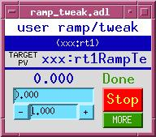
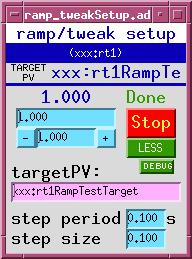
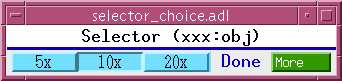
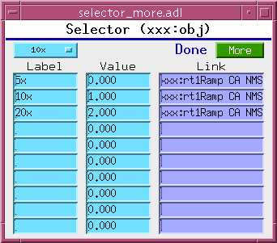

# The synApps std Module

The std module is part of the [synApps](https://epics.anl.gov/bcda/synApps) suite
and provides a collection of records, databases, SNL programs, device support,
and utility code for EPICS IOC applications.

- **Contact:** Keenan Lang
- **Repository:** [epics-modules/std](https://github.com/epics-modules/std)

### Quick Links

| Record Reference | Guides | Database Reference |
|---|---|---|
| [EPID Record](epidRecord.md) | [PID Feedback](pidFeedback.md) | [delayDo](delayDo.md) |
| [Throttle Record](throttleRecord.md) | [Soft Motor](softMotor.md) | [Femto Amplifier](femto.md) |
| [Timestamp Record](timestampRecord.md) | [Timers & Scheduling](timers.md) | [Auto Shutter](autoShutter.md) |
| | | [Remote Shutter](remoteShutter.md) |
| | | [Release Notes](stdReleaseNotes.md) |


## Dependencies

### Build-time Dependencies

| Module | Minimum Version |
|--------|----------------|
| [EPICS Base](https://epics-controls.org/) | 3.15+ (7.0+ recommended) |
| [asyn](https://github.com/epics-modules/asyn) | 4.41+ |
| [SNCSEQ](https://www-csr.bessy.de/control/SoftDist/sequencer/) | 2.2.5+ |

### Runtime Dependencies

The following modules are not required to build std, but many of the databases
in std use record types from these modules:

| Module | Used By |
|--------|---------|
| [calc](https://github.com/epics-modules/calc) | Most databases (provides `transform`, `sseq`, `scalcout`, `swait`) |
| [sscan](https://github.com/epics-modules/sscan) | `trend.db`, `4step.db` |
| [busy](https://github.com/epics-modules/busy) | `ramp_tweak.db`, `selector.db`, `timer.db`, `IDctrl.db` |
| [motor](https://github.com/epics-modules/motor) | `softMotor.db`, `softMotorTf.db`, `zero.db`, `zero2.db` |


## Records

The std module provides three custom record types:

- **[EPID Record](epidRecord.md)** -- Enhanced PID feedback record with
  separation of record and device support, absolute output, integral term
  limiting, and drive limits.

- **[Throttle Record](throttleRecord.md)** -- Throttles the rate of change of a
  value before forwarding it to a target PV, with optional drive limits and
  synchronization.

- **[Timestamp Record](timestampRecord.md)** -- Captures the current time and
  formats it as a string in one of eleven selectable formats.


## Databases

### PID / Feedback Control

Three databases for PID feedback at different speeds and with different hardware
requirements. See the **[PID Feedback](pidFeedback.md)** page for detailed
documentation, comparison, and configuration examples.

| Database | Description |
|----------|-------------|
| `pid_control.db` | Standard soft-channel PID for same-IOC feedback (up to ~10 Hz) |
| `async_pid_control.db` | PID with async trigger-read for cross-IOC or averaging readbacks |
| `fast_pid_control.db` | Hardware-speed PID via asyn drivers (up to ~10 kHz) |

**Autosave:** `pid_control_settings.req`, `async_pid_control_settings.req`,
`fast_pid_control_settings.req`, `epid.req`

### Timers & Scheduling

Three databases for time-based triggering. See the
**[Timers & Scheduling](timers.md)** page for detailed documentation and
comparison.

| Database | Description |
|----------|-------------|
| `timer.db` | General-purpose timer with busy record and scan integration |
| `countDownTimer.vdb` | Count-based up/down timer with H:M:S display |
| `alarmClock.vdb` | Date/time alarm clock with range validation |

Related: `timeString.db` provides a `stringin` record with `Soft Timestamp`
device support for formatted date/time strings.

**Autosave:** `timer.req`, `timer_settings.req`

### Motor Utilities

Two soft motor databases plus motor zeroing utilities. See the
**[Soft Motor](softMotor.md)** page for detailed documentation and comparison.

| Database | Description |
|----------|-------------|
| `softMotor.db` | Soft motor with automated link assembly from PV names |
| `softMotorTf.db` | Soft motor with transform records for coordinate transforms and multi-actuator fan-out |
| `zero.db` | Zeros a motor (Set mode, write 0, Use mode) |
| `zero2.db` | Zeros two motors |
| `all_com_*.db` | *Deprecated.* Use `motorUtil.db` from the motor module instead |

**Autosave:** `softMotor_settings.req`, `softMotorTf_settings.req`

### Shutter Control

| Database | Description |
|----------|-------------|
| `autoShutter.vdb` | Automatic shutter control based on storage ring current. See [Auto Shutter](autoShutter.md) |
| `remoteShutter.db` | Remote shutter open/close via digital output. See [Remote Shutter](remoteShutter.md) |

**Autosave:** `autoShutter.req`, `autoShutter_settings.req`

### Value Manipulation

| Database | Description |
|----------|-------------|
| `ramp_tweak.db` | Ramp and tweak any numeric PV with configurable step size and period. Supports `ca_put_callback` and autosave. |
| `genTweak.db` | Simple tweak (increment/decrement) for any floating-point PV |
| `throttle.db` | Instantiates a [throttle record](throttleRecord.md) |
| `selector.db` | General-purpose menu selector that writes named positions to target PVs. Supports `ca_put_callback` |

 

`ramp_tweak.adl`, `ramp_tweakSetup.adl`

  

`selector.adl`, `selector_choice.adl`, `selector_more.adl`

**Autosave:** `ramp_tweak_settings.req`, `throttle.req`, `selector_settings.req`

### Data Collection

| Database | Description |
|----------|-------------|
| `pvHistory.db` | Collects values of up to 3 PVs in waveform arrays for time-based plotting. Samples every 60 seconds using an `aSub` record with circular buffer |
| `recordPV.db` | Circular-buffer data recorder for a single PV using a `compress` record |
| `trend.db` | Periodic data trending using `sscan` and `swait` records with configurable interval |
| `4step.db` | Multi-step measurement: set conditions, trigger detectors, acquire data, calculate results. Originally for dichroism measurements |

**Autosave:** `pvHistory.req`, `pvHistory_settings.req`,
`4step_settings.req`, `auto_4step_settings.req`

### State Management

| Database | Description |
|----------|-------------|
| `genericState.db` | Save/restore a numeric value to/from any PV via dynamically-constructed CA links |
| `genericStrState.db` | Same as `genericState.db` but for string values |
| `genericStateAux.db` | Groups up to 5-6 `genericState.db` instances for batch save/apply |

**Autosave:** `genericState_settings.req`

### Amplifier Support

Femto brand low-noise current amplifier control with two independent driver
approaches (SNL-based and transform-based). See the
**[Femto Amplifier](femto.md)** page for models, gain tables, and substitution
file examples.

**Autosave:** `femto.req`, `femto_settings.req`, plus model-specific `.req`
files

### Delayed Actions

The `delayDo.db` database and `delayDo.st` SNL program provide intelligent
delayed-action triggering with standby, active, and waiting states. See the
**[delayDo](delayDo.md)** page for documentation and use cases.

**Autosave:** `delayDo_settings.req`

### Miscellaneous

| Database | Description |
|----------|-------------|
| `misc.db` | Utility PVs: `$(P)burtResult` (BURT status), `$(P)iso8601` and `$(P)datetime` (current time strings) |
| `IDctrl.db` | APS insertion-device control front end with energy/gap setpoints, tweaking, and `busy` record |
| `Nano2k.db` | Queensgate Nano2k dual-axis piezo controller via XYCOM-240 digital I/O |
| `sampleWheel.db` | 4-row, 84-position sample wheel with angle/row motor control |
| `userMbbos10.db` | Ten user-configurable MBBO records |

**Autosave:** `mbbo_settings.req`


## Autosave Request Files

The std module includes `.req` files for use with the
[autosave](https://github.com/epics-modules/autosave) module. Each database
listed above that supports autosave has a corresponding `_settings.req` file
(and sometimes a base `.req` file) in `stdApp/Db/`. Load these in your IOC's
`auto_settings.req` file using the same macro substitutions as the database.


## IOC Configuration

### IOC Shell Commands

**`doAfterIocInit(cmd)`** -- Stores the string `cmd` and executes it with
`iocshCmd()` after `iocInit` completes (at `initHookAfterIocRunning`). This
keeps database loads and their associated SNL program launches together in the
startup script:

```
dbLoadRecords("$(CALC)/calcApp/Db/editSseq.db", "P=xxxL:,Q=ES:")
doAfterIocInit("seq &editSseq, 'P=xxxL:,Q=ES:'")
```

**`vxCall(funcName [, arg1, arg2, ...])`** -- *vxWorks only.* Searches the
vxWorks symbol table for a function and calls it with up to 10 arguments,
auto-detecting integers vs strings. Emulates the vxWorks shell from iocsh.

### IOC Shell Scripts

The `stdApp/iocsh/` directory contains scripts for use with `iocshLoad` (EPICS
base 3.15+):

- **`femto.iocsh`** -- Loads `femto.db` and starts the `femto` SNL sequencer.
  See the [Femto Amplifier](femto.md) page for macros.

### Utility Scripts

- **`showBurtDiff`** -- csh script that diffs two BURT snapshot files, showing
  sorted differences.
- **`wrapCmd` / `wrapper`** -- Shell scripts that launch an xterm to run a
  command, keeping the window open for inspection.


## C/C++ Source Code

### Device Support

- **`devTimeOfDay.c`** -- Provides `"Time of Day"` (stringin) and
  `"Sec Past Epoch"` (ai) device support for current time access.
- **`devVXStats.c`** -- *vxWorks only.* Provides `ai`/`ao`/`longin` device
  support for vxWorks system statistics (memory, CPU, file descriptors).

### Header Files

- **`seqPVmacros.h`** -- Convenience macros for SNL programs: `PV()`, `PVA()`,
  `PVAA()` (declare + assign + monitor), `PVPUT()`, `PVPUTSTR()` (put with
  sync), `DEBUG_PRINT()`. Widely used across synApps SNL code.

### SNL Programs

- **`femto.st`** -- Controls Femto current amplifiers via digital output bits.
  See [Femto Amplifier](femto.md).
- **`delayDo.st`** -- Intelligent delayed-action state machine.
  See [delayDo](delayDo.md).
