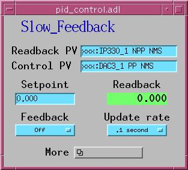
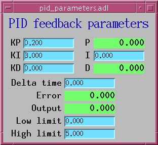

# PID Feedback

The std module provides three databases for PID (Proportional-Integral-Derivative)
feedback control, all built around the [EPID record](epidRecord.md). They differ
in speed, flexibility, and how they communicate with hardware.

## Choosing the Right Database

| | `pid_control.db` | `async_pid_control.db` | `fast_pid_control.db` |
|---|---|---|---|
| **Device support** | Soft Channel | Async Soft Channel | Fast Epid |
| **Speed** | Up to ~10 Hz | Up to ~10 Hz | Up to ~10 kHz |
| **Readback source** | Any EPICS PV | Any EPICS PV (with trigger) | asyn ADC driver (e.g., IP330) |
| **Output target** | Any EPICS PV | Any EPICS PV | asyn DAC driver (e.g., DAC128V) |
| **Cross-IOC** | Same IOC only (DB links) | Yes (CA links) | No (direct asyn) |
| **Trigger-read** | No | Yes (TRIG/TVAL) | No (interrupt-driven) |
| **PID runs in** | Record processing thread | Record processing thread | asyn callback thread |
| **Tweak controls** | Yes (output + setpoint) | Yes (output + setpoint) | No |
| **Stop button** | Yes | Yes | No |
| **Output transform** | No | Yes (`_outcalc`) | No |
| **Record count** | 10 | 12 | 4 |

### When to use each

- **`pid_control.db`** -- General-purpose soft feedback. Use when both the
  readback and control PVs are in the same IOC and the readback device responds
  synchronously. Suitable for slow loops (temperature control, beam position,
  etc.) where 10 Hz update rates are sufficient.

- **`async_pid_control.db`** -- Use when the readback device requires a
  trigger-then-read sequence (e.g., averaging detectors, slow instruments). Also
  use when the readback PV is in a different IOC (CA links). The TRIG link
  triggers the readback, waits for completion via callback, then reads the
  result.

- **`fast_pid_control.db`** -- Use when feedback must run faster than the EPICS
  scan system allows. The PID computation runs directly in the asyn interrupt
  callback at hardware speed. Requires asyn-compatible ADC and DAC hardware.


## pid_control.db -- Standard PID

### Macros

| Macro | Default | Description |
|-------|---------|-------------|
| `P` | | PV prefix |
| `PID` | | PID instance name |
| `INP` | | Readback PV (DB link to controlled variable) |
| `OUT` | | Output PV (where the manipulated variable is written) |
| `SCAN` | `.1 second` | Feedback update rate |
| `KP` | `0.1` | Proportional gain |
| `KI` | `1` | Integral gain (repeats/second) |
| `KD` | `0` | Derivative gain (seconds) |
| `LOPR` | `0` | Low operating range (display) |
| `HOPR` | `10` | High operating range (display) |
| `DRVL` | `0` | Low drive limit on output |
| `DRVH` | `10` | High drive limit on output |
| `PREC` | `3` | Display precision |

### Records

| Record | Type | Purpose |
|--------|------|---------|
| `$(P)$(PID)` | `epid` | Core PID controller (DTYP: Soft Channel) |
| `$(P)$(PID)_limits` | `transform` | Propagates DRVL/DRVH to the epid record |
| `$(P)$(PID)_incalc` | `transform` | Stub for user-defined input calculation |
| `$(P)$(PID)OUT_tweak` | `ao` | Output tweak step size |
| `$(P)$(PID)OUT_tweak_up` | `calcout` | Tweak output up by step |
| `$(P)$(PID)OUT_tweak_down` | `calcout` | Tweak output down by step |
| `$(P)$(PID)SP_tweak` | `ao` | Setpoint tweak step size |
| `$(P)$(PID)SP_tweak_up` | `calcout` | Tweak setpoint up by step |
| `$(P)$(PID)SP_tweak_down` | `calcout` | Tweak setpoint down by step |
| `$(P)$(PID)Stop` | `ao` | Turns off feedback (FBON=0), then zeroes output |
| `$(P)$(PID)Stop2` | `ao` | Writes 0 to the output PV |

### Signal Flow

```
$(INP) ---[INP]---> epid $(P)$(PID) ---[OUTL]---> $(OUT)
                          |
                        [FLNK]
                          v
                    $(P)$(PID)_limits ---[OUT]--> epid.DRVL / epid.DRVH
```

The `_incalc` transform record is an empty stub. Configure its expressions and
links to pre-process the readback value before it reaches the epid record.

### Example

```
dbLoadRecords("$(STD)/stdApp/Db/pid_control.db", "P=xxx:,PID=pid1,INP=xxx:readback,OUT=xxx:dac1,DRVL=0,DRVH=10,KP=0.05,KI=2,KD=0")
```

### MEDM Displays

 

`pid_control.adl`, `pid_parameters.adl`

### Autosave

Use `pid_control_settings.req` with macros `P=$(P)`, `PID=$(PID)`. This saves
all tuning parameters, link definitions, tweak values, and both transform
records.


## async_pid_control.db -- Asynchronous PID

This database adds support for readback devices that require a trigger-then-read
sequence, and provides an output transform stage.

### Additional Macros

Same macros as `pid_control.db`, but **no defaults** -- all must be supplied.
The `INP` link uses the `CA` attribute for cross-IOC compatibility.

### Additional Records

In addition to all the records from `pid_control.db`:

| Record | Type | Purpose |
|--------|------|---------|
| `$(P)$(PID)_outcalc` | `transform` | Output calculation stage (between epid OVAL and output PV) |

The epid record uses `DTYP="Async Soft Channel"`, which enables two additional
fields:

| Field | Purpose |
|-------|---------|
| `TRIG` | Output link: triggers the readback device before reading |
| `TVAL` | Value written to the TRIG link |

### How Async Processing Works

1. The record processes and writes `TVAL` to `TRIG` via `dbCaPutLinkCallback`.
2. Processing pauses (PACT=TRUE) until the callback completes.
3. When the readback device finishes, the callback fires and the record resumes.
4. The controlled value is read from `INP`, PID is computed, and `OVAL` is
   written to `OUTL`.

This two-pass mechanism allows PID control with slow or averaging readback
devices. For example, using the calc module's `userAve10.db` to average multiple
readings before the PID loop sees the result.

### Example

```
dbLoadRecords("$(STD)/stdApp/Db/async_pid_control.db", "P=xxx:,PID=apid1,INP=xxx:avgResult CA,OUT=xxx:dac1,SCAN=1 second,KP=0.1,KI=0.5,KD=0,LOPR=0,HOPR=10,DRVL=0,DRVH=10,PREC=3")
```

Configure the TRIG and TVAL fields at runtime (or via autosave) to point at the
readback trigger PV.

### Autosave

Use `async_pid_control_settings.req` with macros `P=$(P)`, `PID=$(PID)`. This
includes everything from `pid_control_settings.req` plus `TRIG`, `TVAL`, and the
`_outcalc` transform.


## fast_pid_control.db -- Fast (Hardware) PID

This database runs PID feedback at hardware interrupt rates (up to ~10 kHz)
using asyn drivers. The PID computation happens in the asyn callback thread,
completely independent of EPICS record processing.

### Macros

| Macro | Description |
|-------|-------------|
| `P` | PV prefix |
| `PID` | PID instance name |
| `INPUT` | asyn port name for the input device (e.g., IP330 ADC) |
| `ICHAN` | Input channel number |
| `INPUT_DATA` | asynDrvUser string for the data callback |
| `INPUT_INTERVAL` | asynDrvUser string for the time-interval callback |
| `OUTPUT` | asyn port name for the output device (e.g., DAC128V) |
| `OCHAN` | Output channel number |
| `OUTPUT_DATA` | asynDrvUser string for the output write |
| `SCAN` | How often to refresh the display (not the feedback rate) |
| `KP`, `KI`, `KD` | PID gains |
| `DT` | Requested time per feedback point (seconds) |
| `LOPR`, `HOPR` | Operating range |
| `DRVL`, `DRVH` | Drive limits |
| `PREC` | Display precision |

### Records

| Record | Type | Purpose |
|--------|------|---------|
| `$(P)$(PID)` | `epid` | PID controller (DTYP: Fast Epid). INP is INSTIO. |
| `$(P)$(PID)_limits` | `transform` | Propagates DRVL/DRVH |
| `$(P)$(PID)_incalc` | `transform` | Input calculation stub |
| `$(P)$(PID)Locked` | `bo` | Lock status indicator |

### Architecture

The epid record does **not** drive the feedback loop. Instead:

```
Hardware ADC ---[asyn interrupt]---> dataCallback()
                                        |
                                     do_PID()
                                        |
                                 asynFloat64->write()
                                        |
                                        v
                                   Hardware DAC

epid record (periodic SCAN) <---> epidFastPvt structure
  - Copies user changes (KP, KI, KD, VAL, FBON, DRVL, DRVH) to private data
  - Copies current state (CVAL, ERR, OVAL, P, I, D, DT) back for display
```

The `SCAN` field controls how often the record takes a "snapshot" of the
feedback state for display purposes. The actual feedback rate is determined by
the hardware interrupt rate and the `DT` field. If `DT` is longer than the
hardware callback interval, multiple readings are averaged before each PID
computation.

### INP Field Format

The INP field uses INSTIO format. Because the full parameter string exceeds the
INP field length, parameters are split between INP and DESC:

```
field(INP, "@$(INPUT) $(ICHAN) $(INPUT_DATA) $(INPUT_INTERVAL)")
field(DESC, "$(OUTPUT) $(OCHAN) $(OUTPUT_DATA)")
```

At initialization, device support concatenates these two strings and tokenizes
them to extract all seven parameters.

### Example

```
dbLoadRecords("$(STD)/stdApp/Db/fast_pid_control.db", "P=xxx:,PID=fPID1,INPUT=Ip330_1,ICHAN=0,INPUT_DATA=DATA,INPUT_INTERVAL=SCAN_PERIOD,OUTPUT=DAC1,OCHAN=0,OUTPUT_DATA=DATA,SCAN=1 second,KP=0.01,KI=10,KD=0,DT=0.001,LOPR=0,HOPR=10,DRVL=0,DRVH=10,PREC=4")
```

### Autosave

Use `fast_pid_control_settings.req` with macros `P=$(P)`, `PID=$(PID)`. This
saves tuning parameters and the `_incalc` transform, but not `INP` or `OUTL`
(which are fixed at load time by the asyn port configuration).


## Tuning Guide

For guidance on selecting optimal values for `KP`, `KI`, and `KD`, see the
[Feedback Tuning](epidRecord.md#feedback-tuning) section in the EPID record
documentation.

For a detailed discussion of why the EPID record uses absolute output values
(rather than the differential output of the standard EPICS PID record), see
[Problems with the Standard EPICS PID Record](epidRecord.md#problems-with-the-standard-epics-pid-record).


## Autosave Request Files

| Database | Request File |
|----------|-------------|
| `pid_control.db` | `pid_control_settings.req` |
| `async_pid_control.db` | `async_pid_control_settings.req` |
| `fast_pid_control.db` | `fast_pid_control_settings.req` |
| Bare epid record | `epid.req` |
