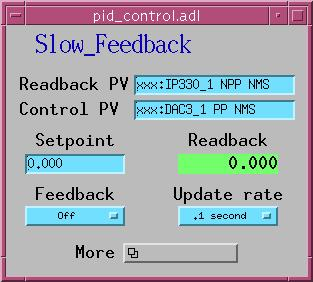
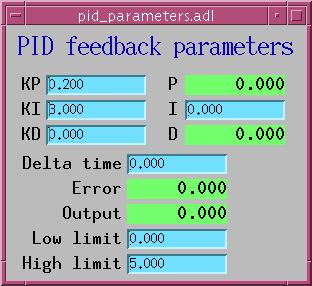
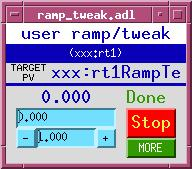
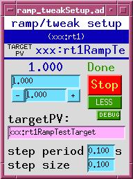
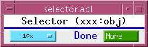
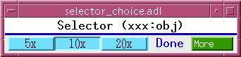
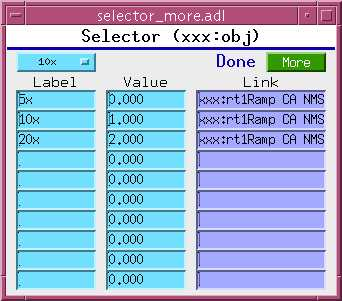

The synApps std module
======================

The std module publishes the following software items for use by ioc applications : 

Records
-------

[epidRecord.html](epidRecord.md) Extended PID feedback record 

[throttleRecord.html](throttleRecord.md) Throttle record Databases and GUI display files


--------------------------------------------

### 4step.db, 4step.adl

Implements a multistep measurement that may involve up to four sets of the following operations:

1. set conditions and wait for completion (execute a string-sequence record)
2. trigger up to two detectors and wait for completion
3. acquire scalar data from up to four PVs, for each measurement step, and cache in local PVs.

When all measurement steps have completed, performs up to four calculations on cached scalar data.

The original purpose of this database was to allow the sscan record to perform a preprogrammed dichroism measurement, in which a measurement is made under two conditions (say, 'a' and 'b'), and the result (Ma-Mb)/(Ma+Mb) is recorded.

### IDctrl.db, xxIDCtrl.adl

A front end for the APS insertion-device control system. This database allows an ID to be driven by a ca\_put\_callback() command.

### Nano2k.db, Nano2k.adl

Support for the Queensgate Nano2k piezo controller.

### all\_com\_\*.db

Deprecated collection of databases for fanning out a "stop" command to all motor records in an ioc, and for rolling up all motor-moving states into a single PV. The motor module has a better way of doing this (motorUtil.db, and the motorUtilInit() command invoked from the ioc startup file).

### pid\_control.db, pid\_\*.adl

Implements a PID (proportional/integral/differential) feedback loop, reading values from a readback PV, comparing with a desired value, and writing corrections to a control PV. This record-based feedback loop is for low-speed applications, and is very general because it can use any EPICS PVs for readback and control.

  
pid\_control.adl, pid\_parameters.adl

### async\_pid\_control.db, async\_pid\_control.adl

A version of pid\_control with two improvements:

1. The readback PV can be an asynchronous record. The std module implements the "Async Soft Channel" device type for the epid record, which executes the record's readback-trigger link, and waits for completion before reading the result.
2. The database provides a transform record to process the output value before using it to drive the target PV.

The original purpose of async\_pid\_control was to support feedback control with a noisy readback device, by using the calc module's userAve10.db database to average over a number of measurements. ### fast\_pid\_control.db

Implements a PID (proportional/integral/differential) feedback loop, reading values from a readback PV, comparing with a desired value, and writing corrections to a control PV. This inerrupt-service-routine based loop can run very fast (up to around 10 kHz) but is restricted in readback and control PVs. The readback must be an appropriately supported analog input device, such as the IP330 ADC, and the control must be an appropriately supported analog output device, such as the DAV128V.

### femto\*.db, femto\*.adl

Support for Femto (brand name) low-noise current amplifier.

### delayDo.db

See [delayDo documentation](delayDo.md)

### genTweak.db

Adds tweak functionality to any floating point PV

### ramp\_tweak.db, ramp\_tweak\*.adl

Adds ramp and tweak functionality to any numeric PV. To use, type the name of the PV into the "targetPV:" text-entry field (or use Drag-And-Drop), and set the step period and size. If you don't want ramping, set the step size to zero.

This database supports ca\_put\_callback. When the desired-value or tweak fields are written to by a ca\_put\_callback, the callback will not be sent until the target has reached the new desired value. The database also supports autosave, and will correctly initialize itself after a reboot.

  
ramp\_tweak.adl, ramp\_tweakSetup.adl

### genericState.db, genericState.adl genericStateAux.db genericStrState.db

I don't know what this is.

### misc.db

Miscellaneous PVs: burtResult, ISO8601 time-stamp string

### pvHistory.db, pvHistory\*.adl

Collects values of up to three PVs in arrays for plotting as functions of time.

### autoShutter.vdb

See [README\_autoShutter](README_autoShutter)

### remoteShutter.db

See [README\_remoteShutter](README_remoteShutter)

### sampleWheel.db, sampleWheel\*.adl

Support for one particular sample holder.

### scaler\*.db, scaler\*.adl

Support for the scaler record.

### softMotor.db, softMotor\*.adl

Support for a soft motor record that can be attached at run time to a real motor or other motorlike collection of PVs.

### timeString.db

A stringin record with "Soft Timestamp" device support

### alarmClock.vdb, alarmClock\*.adl

Cause a specified action to occur at a specified date and time.

### countDownTimer.vdb, countDownTimer\*.adl

Cause a specified action to occur after a specified time interval.

### timer.db, timer\*.adl

Cause a specified action to occur after a specified time interval

### trend.db

I don't know what this is.

### userMbbos10.db, userMbbo\*.adl

Ten MBBO records.

### zero.db, zero2.db

A string-sequence record configured to zero a motor by putting it into "Set" mode, writing zero to its VAL field, and putting it into "Use" mode. zero2 does the same thing for two motors.

### selector.db

A general purpose selector, which allows the deployer to attach a menu to a list of actions. For example, to implement control of a motor for which discrete positions have special significance (mirror stripe, sample-wheel angle), one edits selector.substitutions (see iocBoot/iocStdTest) with the names and motor positions, and the target PV (or PVs) to which those positions should be written. The menu selection can be made by a client using ca\_put\_callback().

It's possible to configure the target PV at run time. If this is done, it's important to note that the links shown below in selector\_more.adl must have the attribute "CA", because the record is configured to wait for completion, which can't be done with a PP link.

  
selector.adl, selector\_choice.adl,selector\_more.adl

Other code
----------

### doAfterIocInit(char \*cmd)

Stores the string cmd and executes it with iocshCmd() after iocInit. This is useful to simplify maintenance of command files that specify databases which must be paired with code (such as State Notation Language programs) that must be invoked after iocInit. It's tedious and error prone to have the commands separated. doAfterIocInit() allows this:

> ```
> # editSseq - edit any sseq or seq record
> dbLoadRecords("$(CALC)/calcApp/Db/editSseq.db", "P=xxxL:,Q=ES:")
> # Don't forget to run the sequence program, editSseq, below
> ...
> unrelated commands
> ...
> iocInit
> ...
> more unrelated commands
> ...
> seq &editSseq, 'P=xxxL:,Q=ES:'
> ```

to be replaced by this: 
> ```
> # editSseq - edit any sseq or seq record
> dbLoadRecords("$(CALC)/calcApp/Db/editSseq.db", "P=xxxL:,Q=ES:")
> doAfterIocInit("seq &editSseq, 'P=xxxL:,Q=ES:'")
> ```

### vxCall(char \*funcName \[, char \*arg1, char \*arg2, ...\])

Searches the vxWorks symbol table for a function that matches the string funcName, then executes the function with the given arguments. vxCall will parse each argument to determine if it represents a number or a string and pass the correct values to the vxWorks function.
